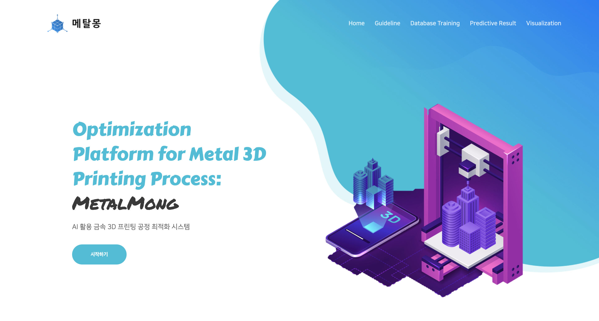
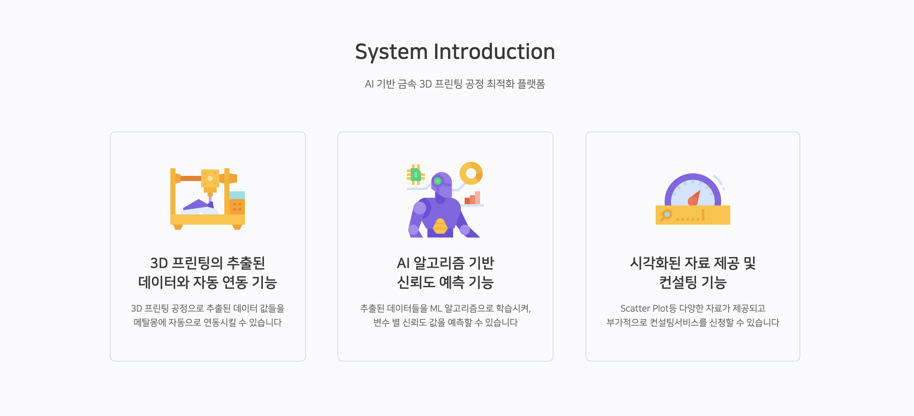

# Sungkyun-AI-Chaellnge
AI-based metal 3D printing process optimization platform

<h3> 1. Member </h3>

|  
성명
 |  
학과
 |  
역할
 |
|:--------|:--------:|--------:|
|**김동원** | 
기계공학과 
 |금속 출력물의 용융풀 (Pool)형상 및 영역 분석 |
|**김민겸** | 
기계공학과 
 |Flow-3D 이용, 용융풀에서 유체 거 동 해석 (CFD) |
|**김태환** | 
기계공학과 
 |Simufact 이용, 적층제조 과정에서 잔류응력 해석 (FEM) |
|**이정민** | 경영학과&컴퓨터공학과 |  Flask를 활용하여 인공지능 모델 기 반으로 데이터 시각화 페이지 Web 개발 |
|**정채원** | 
경영학과&소프트웨어학과 
 |학습알고리즘 결과를 조회할 수 있는 Web 개발 ( Web Front-end 개발   인공지능 알고리즘을 학습해서 신 뢰도가 나오게 개발) |

<h3> 2. Introduction </h3>

> 따라서 본 과제에서는 3DP Simulation 해석을 기반으로 금속 3D 프린팅 공정과 결함이 생기는 원인 등을 분 석할 뿐만 아니라, 구축된 해석 결과값 DB를 기반으로 인공지능 알고리즘을 활용하여 공정조건에 따른 공정실 패 및 부품의 품질을 예측하고, 나아가 사용자가 원하는 출력물 품질에 따른 최적화된 공정조건도 제시하고자 한다. 이를 통해 기존의 단순한 시행착오 방식과 비교시, 공정 예측을 통해 선별된 공정변수만을 이용하여, 출력 해볼 시편의 숫자를 최소화 할 수 있어 소요되는 시간 및 비용을 획기적으로 단축할 수 있다. 실제 산업에서의 금속 3DP 제조기술의 문제점이 위에서 언급하였듯이 장비, 소재에 따라 공정조건이 매우 다르고 공정을 안정화하는데 시간과 비용이 매우 소요되기에 실질적으로 엔지니어들이 이를 활용하는 데 어려 움이 많다.TRL (기술성숙도)를 높여 실제 산업에서 위 연구 내용이 활용될 수 있도록 장비 엔지니어용으로 웹 개발 도 구 중 적합한 도구를 활용하여 웹 상에서 쉽게 공정변수에 따른 제조품질 예측모델(AI)이 탑재된 웹 기반 프로 그램을 개발할 예정이다. 개발된 웹 기반 프로그램을 활용하여 사용자가 접근하여 데이터에 대한 신뢰도를 파악 할 수 있고, 모델을 활용한 제조품질 예측결과를 직관적으로 알 수 있도록 한다
